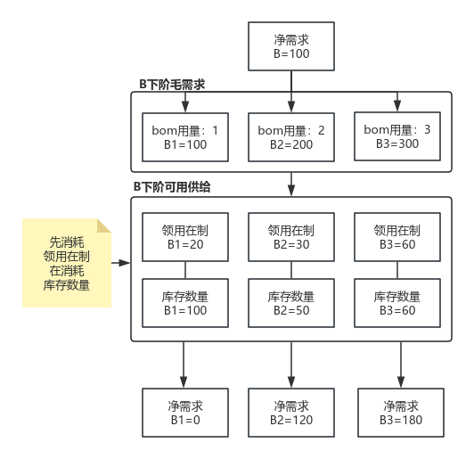
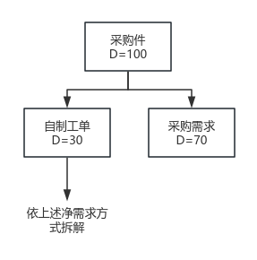
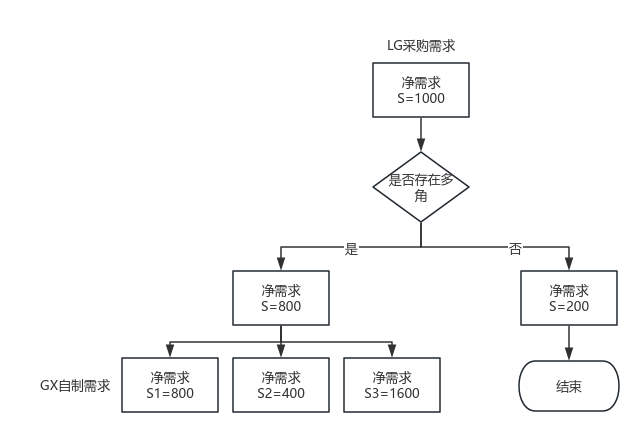

# 文档 2 — 《集团MRP需求分解与执行系统需求文档》

- **URL**: https://loctek.feishu.cn/docx/UXtLdoGsloylVCxYJRzc8Jcinkc
- **抓取时间**: 2026-07-24
- **状态**: 写到 d.i 截止（d.ii 采购物料、d.iii 委外物料、流程图、表格、接口、验收、附录均在文档里有，但因 docx 懒加载 + extractor 兼容问题，**未抓到全部**）

> 文档包含 3 张图，已下载到 `02-集团MRP需求分解与执行系统需求文档-assets/`：
> - `bom-tree.png` - 净需求分解树状图（B1/B2/B3 = 100/200/300 → 0/120/180）
> - `image-2.png` - 采购件 D 优先级分解（自制工单 D=30 + 采购需求 D=70）
> - `image-3.png` - 多角贸易/呆滞物料流程图（LG S=1000 → 是否多角 → GX 800 or GN 200）

---

《集团MRP需求分解与执行系统需求文档》

一、文档概述

a. 目的
明确集团物料需求计划（MRP）的分解逻辑与执行流程，确保系统能自动根据主计划生成各层级物料需求，并实现与现有系统（如鼎捷ERP、MES）的数据协同。

b. 范围
本文档涵盖主计划获取、毛需求分解、净需求计算、层级需求展开、数据同步与异常处理等功能需求。

c. 读者对象
项目经理、开发团队、测试人员、供应链部门、IT支持人员。

二、功能需求

a. 主计划获取与处理
~~[删除线] i. 从LG/YN/QU/FN/GX各据点获取主计划数据，包含GD01/GD16/GD04/GD15/GD35/GD36/XS12及安全库存信息。~~ ← **划线**
ii. 不分据点，只按时间顺序排列主计划数据，作为基准来源（料件A）。

b. 第一层毛需求分解
i. 根据主计划A的工单备料明细，分解第一层物料的工单毛需求（例如：B=100、C=150、D=200）。
ii. 调用鼎捷系统基础资料，获取料件的补给策略（外购/自制/委外）、采购单位批量（D=150）、最小起订量（E=500）、生产提前期等信息。

c. 净需求计算
i. 预计开工时间：第一层开工时间为预计完工时间-生产提前期/采购提前期；头层的下一阶物料的开工时间为预计完工时间-生产提前期/采购提前期
ii. 预计完工时间：第一层完工时间为主计划的开工时间；头层的下阶物料的完工时间为上一层计划的开工时间
iii. 领用在制：工单备料领出未入库的备料用量。
iv. 多角在途：多角贸易发出但是暂未入库数量
v. 第一层毛需求（例如：B=100、C=150、D=200）中扣除现有库存量及领用在制量，生成净需求（例如：B=50、C=100、D=100）。即净需求 = 毛需求- 领用在制 - 库存 - 多角在途
vi. 第一层物料的下阶物料的净需求 = 上层物料的净需求*bom用量 - 领用在制 -库存 - 多角在途

后续下层物料净需求以此类推向下分解计算

~~[删除线] 若维护了采购单位批量（D=150）、最小起订量（E=500），则B的净需求为采购单位批量倍数（若D净需求为50时则显示为150，若D净需求为200则显示为300），则E的净需求为小于500时按500来算。~~ ← **整段划线**

d. 层级净需求展开与优先级处理
i. 对自制物料（B=50、C=100）：
1. 优先匹配在制生产订单的余量（如B的工单余量为20、C的工单余量为30），B/C向下分解为下阶需求的时候，优先以B=20、C=30工单的备料明细部分分解为下阶需求。
2. 无工单部分（B=30、C=70）通过据点BOM结构展开下一层级的毛需求。
3. 循环处理后续层级，直至最底层需求分解完毕。

ii. 对采购物料（D=100）：（依据 image-2.png）
- 拆分为：**自制工单 D=30** + **采购需求 D=70**
- 自制工单部分依上述净需求方法拆解

iii. 对委外物料（文档未完整截取）

## 文档图片

